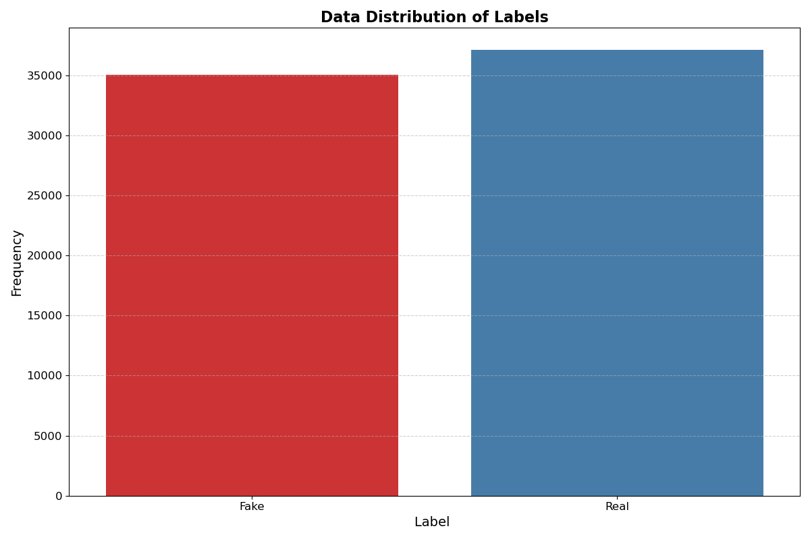
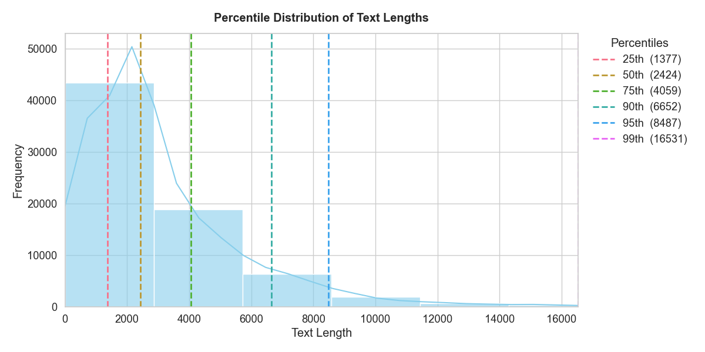
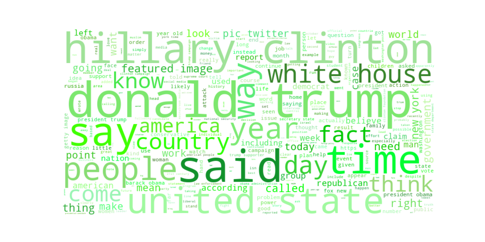
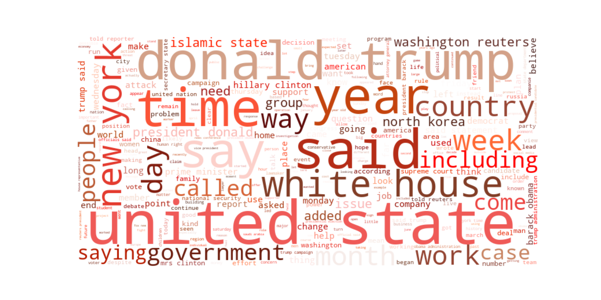
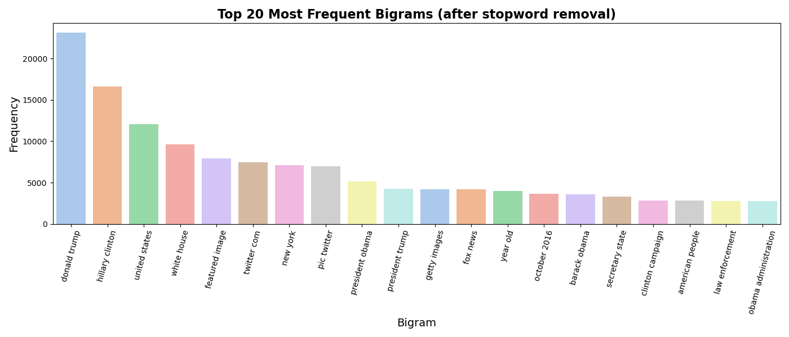
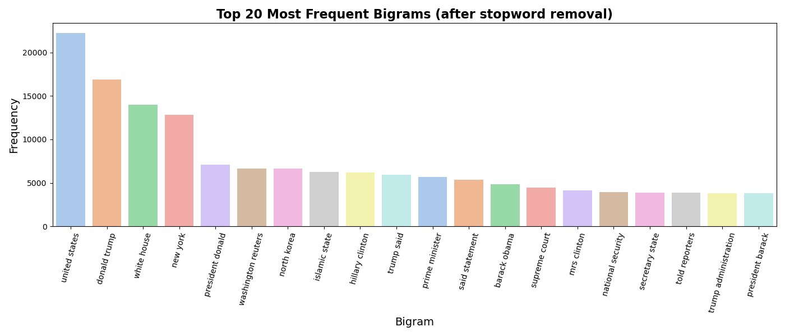
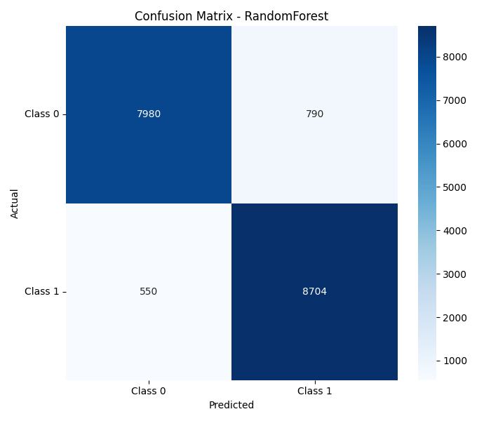
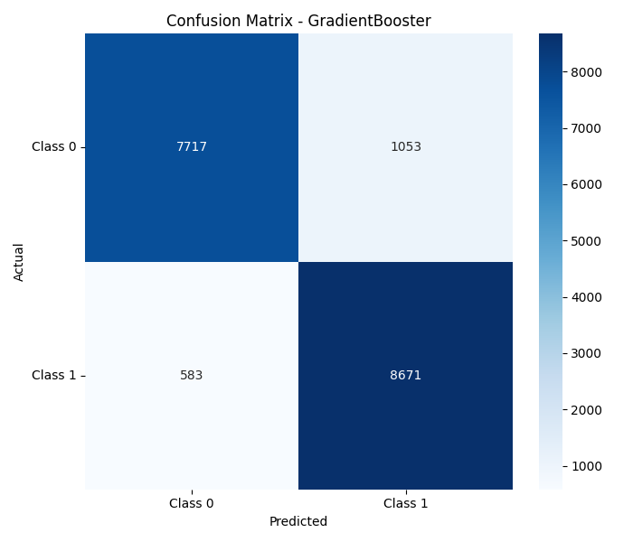
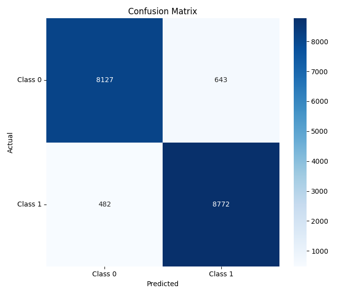
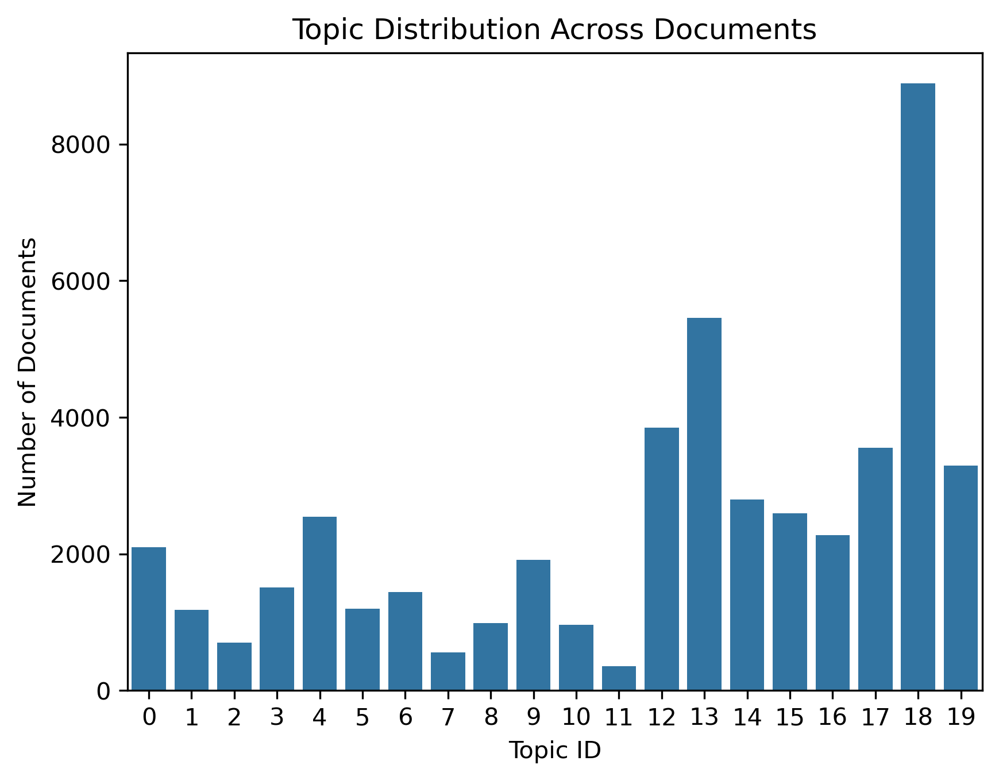

# AMLproject — Fake News Detection & Generation

> **Applied Machine Learning Course Project** | MIT License

---

## English

### Overview

This project explores the intersection of **fake news detection** and **news generation** using machine learning. We build classifiers that distinguish real news from fake news, train generative models to produce news articles, and analyze what drives the classifier's decisions.

### Motivation

The proliferation of misinformation poses a serious threat to public discourse. This project investigates two key questions:

1. **Can ML classifiers reliably distinguish fake news from real news?**
2. **Can generative models produce realistic enough news to fool those classifiers?**

By studying both sides — detection and generation — we gain deeper insight into the strengths and vulnerabilities of news authenticity systems.

### Project Structure

```
AMLproject/
├── code/                        # Core implementation scripts
├── data/                        # Training and evaluation datasets
├── data_analysis/               # Exploratory data analysis
├── model/                       # Model definitions and saved checkpoints
├── topic_model/                 # Topic modeling components
├── tree_classifiers/            # Decision tree and ensemble classifiers
├── Hybrid_Classifier_Transformer.ipynb   # Transformer-based classification
├── Test_Generate_Classify.ipynb          # Generation + classification pipeline
└── README.md
```

### Key Components

| Component | Description |
|-----------|-------------|
| **Classifier** | Binary classifier distinguishing real vs. fake news, built on IMDB-sentiment-classification baselines and extended with transformer architectures |
| **Generators** | Two generative models (inspired by nanoGPT), each trained on either real or fake news corpora |
| **Analysis** | Latent space visualization (t-SNE, UMAP), attention heatmaps, bias/drift measurement, and hyperparameter optimization |

### Datasets

We use four datasets:
- **Real news** — original real news articles
- **Fake news** — original fake news articles
- **Real model dataset** — processed real news (title, category, text, source)
- **Fake model dataset** — processed fake news (same fields)

### Methods

- **Classification**: Transformer-based classifier with hyperparameter tuning (learning rate, batch size, tokenization strategy)
- **Generation**: nanoGPT-style autoregressive language models
- **Analysis**:
  - Vocabulary and word distribution comparison
  - Style, tone, and structural analysis
  - Latent space visualization via t-SNE and UMAP
  - Attention heatmap inspection
  - Topic emphasis drift and memorization difference detection

### Results

#### Data Distribution & Text Length Analysis

<p align="center">
  
  
</p>

#### Frequent Words: Real vs. Fake News

<p align="center">
  
  
</p>

#### Top Bigrams Comparison

<p align="center">
  
  
</p>

#### Classifier Confusion Matrices

<p align="center">
  
  
</p>

<p align="center">
  
  
</p>

#### Topic Modeling

<p align="center">
  
</p>

<p align="center">
  
</p>

### License

This project is licensed under the [MIT License](LICENSE).

---

## 中文

### 项目概述

本项目是**应用机器学习**课程的团队项目，围绕**假新闻检测**与**新闻生成**两大主题展开研究。我们构建了能够区分真实新闻与虚假新闻的分类器，训练了可以生成新闻文章的生成模型，并深入分析了分类器的决策机制。

### 研究动机

虚假信息的泛滥对公共话语构成了严重威胁。本项目旨在回答两个核心问题：

1. **机器学习分类器能否可靠地区分真假新闻？**
2. **生成模型能否生成足够逼真的新闻来欺骗分类器？**

通过同时研究检测与生成两个方面，我们能够更深入地理解新闻真实性识别系统的优势与脆弱性。

### 项目结构

```
AMLproject/
├── code/                        # 核心实现代码
├── data/                        # 训练与评估数据集
├── data_analysis/               # 探索性数据分析
├── model/                       # 模型定义与保存的检查点
├── topic_model/                 # 主题建模组件
├── tree_classifiers/            # 决策树与集成分类器
├── Hybrid_Classifier_Transformer.ipynb   # 基于 Transformer 的分类
├── Test_Generate_Classify.ipynb          # 生成 + 分类测试流水线
└── README.md
```

### 核心模块

| 模块 | 说明 |
|------|------|
| **分类器** | 二分类器，区分真实与虚假新闻，基于 IMDB 情感分类基线扩展，结合 Transformer 架构 |
| **生成器** | 两个生成模型（参考 nanoGPT），分别在真实新闻和虚假新闻语料上训练 |
| **分析模块** | 潜空间可视化（t-SNE、UMAP）、注意力热力图、偏差/漂移测量、超参数优化 |

### 数据集

使用四份数据集：
- **真实新闻** — 原始真实新闻文章
- **虚假新闻** — 原始虚假新闻文章
- **真实新闻处理集** — 经过清洗处理的真实新闻（标题、类别、正文、来源）
- **虚假新闻处理集** — 经过清洗处理的虚假新闻（相同字段）

### 方法

- **分类**：基于 Transformer 的分类器，进行超参数调优（学习率、批大小、分词策略）
- **生成**：基于 nanoGPT 风格的自回归语言模型
- **分析**：
  - 词汇与词频分布对比
  - 风格、语气与结构分析
  - 通过 t-SNE 和 UMAP 进行潜空间可视化
  - 注意力热力图检查
  - 主题偏移与记忆差异检测

### 实验结果

#### 数据分布与文本长度分析

<p align="center">
  
  
</p>

#### 高频词对比：真实新闻 vs 虚假新闻

<p align="center">
  
  
</p>

#### Top 20 二元组对比

<p align="center">
  
  
</p>

#### 分类器混淆矩阵

<p align="center">
  
  
</p>

<p align="center">
  
  
</p>

#### 主题建模

<p align="center">
  
</p>

<p align="center">
  
</p>

### 许可证

本项目基于 [MIT 许可证](LICENSE) 开源。
